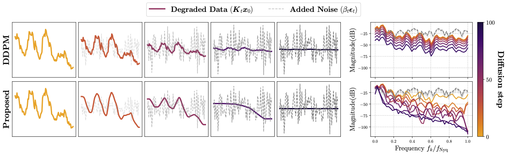

# (ICML2025) A Non-isotropic Time Series Diffusion Model with Moving Average Transitions
*Authors: Chenxi Wang, Linxiao Yang, Zhixian Wang, Liang Sun and Yi Wang**



This repo is the Pytorch implementation of our MATSD (Moving Average Time Series Diffusion). Different from the standard DDPM, we re-designed the diffusion process with moving average, a low-pass filter, for time series data to pretain more low-frequency information at all diffusion steps. The backward process can then be naturally viewed as time series super-resolution. We evaluated MATSD on time series tasks like forecasting, super-resolution and synthesis. 

## Requirements
Python version: 3.10

The must-have packages can be installed by running
```
conda create -n matsd python=3.10
pip install -r requirements.txt
python setup.py develop
```

## Datasets
We attached all the datasets used on the [Google Drive](https://drive.google.com/drive/folders/17qE_Kdf9r7E4BIlkSvyIp0YSoTT4gEqq?usp=share_link). Please download and paste them into this `Datasets/`folder.

## Usage
Experiments include time series forecasting (fcst), super-resolution (sr) and synthesis (uncond).

- **Forecasting**: look back 96 time steps, and predict next {96, 192, 336, 720} steps.
- **Super-resolution**: input a low-resolution time seris, and output {3, 6, 12} times high-resolution results.
- **Synthesis**: unconditionally generate time series at length=24.

To train and sample MATSD, run the bash scripts:
```
bash run_{fcst, sr, uncond}.sh
```

Hyperparameters can be adjusted in `configs/`, and more arguments about training/sampling, see `scripts/{train, sample}_{fcst, sr, uncond}.py`


## Citation
TO BE UPDATED